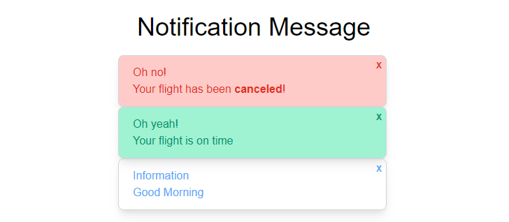

# notification-message

## Create a Notification Message Component

Exercice by vueschool.io ("https://vueschool.io/lessons/create-a-notification-message-component").

For build this components i used vite.js with the template vue (with the last rfc "https://github.com/vuejs/rfcs/blob/script-setup-2/active-rfcs/0000-script-setup.md") and tailwindcss.

## Installation

1. git clone this repository
2. cd github-profile-card
3. npm install
4. npm run dev
